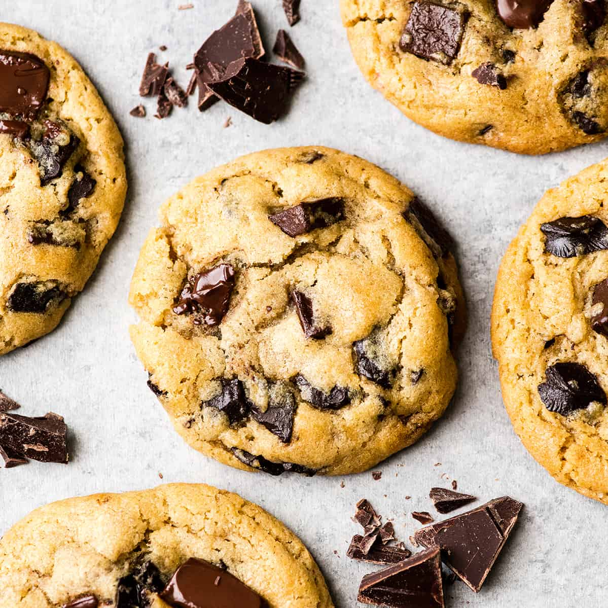

# Chocolate Chip Cookies

### Ingredients

- 1 cup salted butter (softened)
- 1 cup granulated sugar
- 1 cup light brown sugar (packed)
- 2 teaspoons pure vanilla extract
- 3 cups all-purpose flour
- 1 teaspoon baking soda
- 1/2 teaspoon baking powder
- 1 teaspoon sea salt
- 2 cups chocolate chips

### Instructions

1. Preheat oven to 375 degrees Fahrenheit (190 degrees Celsius). Line three baking sheets with parchment paper and set aside.
2. In a medium bowl mix flour, baking soda, baking powder and salt. Set aside.
3. Cream together butter and sugars until combined.
4. Beat in eggs and vanilla until light (about 1 minute).
5. Mix in the dry ingredients until combined.
6. Add chocolate chips and mix well.
7. Roll 2-3 Tablespoons (depending on how large you like your cookies) of dough at a time into balls and place them evenly spaced on your prepared cookie sheets.
8. Bake in preheated oven for approximately 8-10 minutes. Take them out when they are just barely starting to turn brown.
9. Let them sit on the baking pan for 5 minutes before removing to cooling rack.

[Link to original recipe](https://joyfoodsunshine.com/the-most-amazing-chocolate-chip-cookies/)
