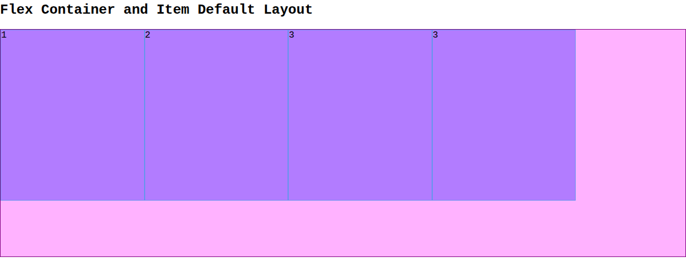
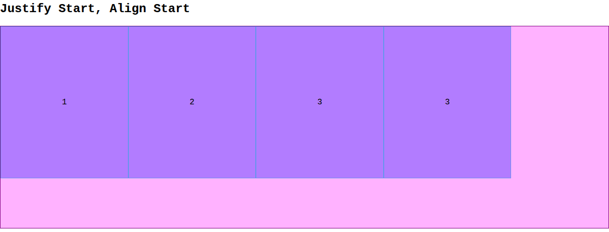
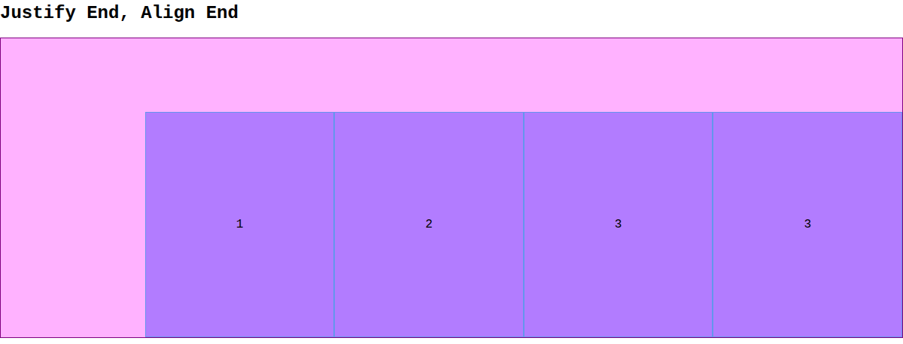
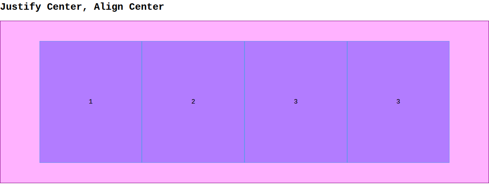
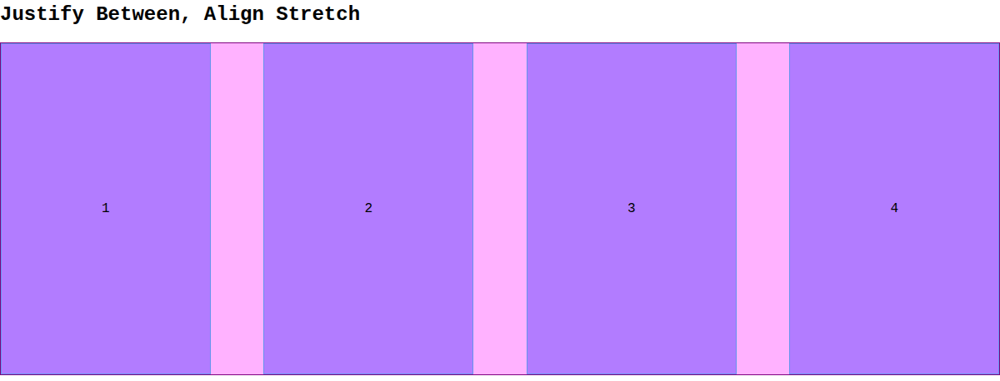
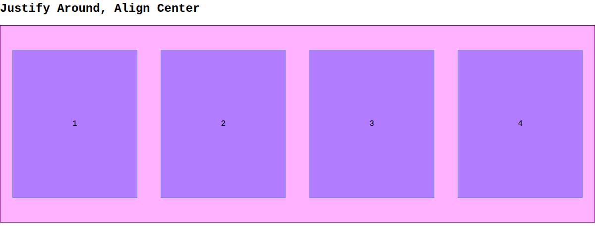
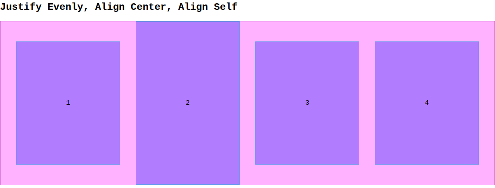
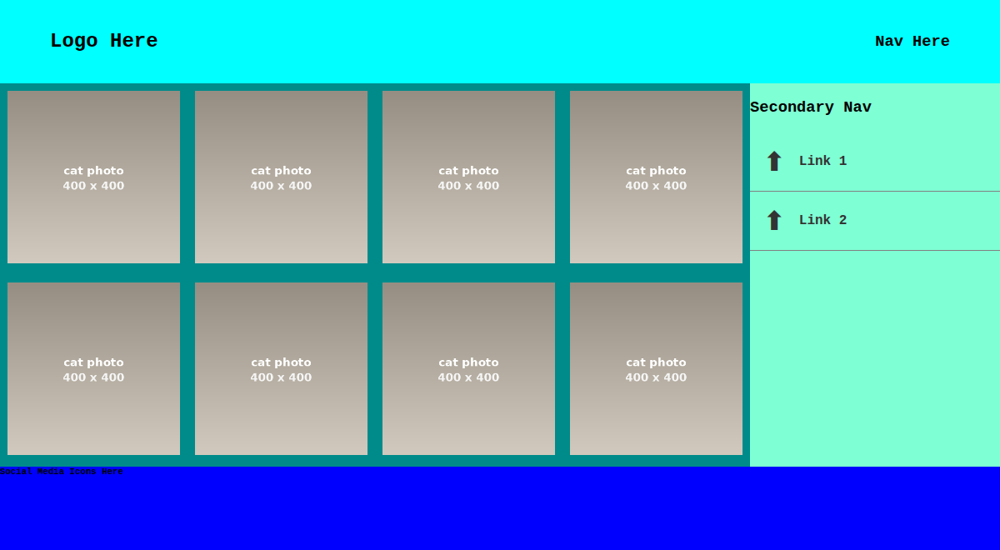

# Week 04 — Flexbox

*The layout tool you'll use for almost everything · ~90 min of live coding*

> **Following along at home?** Work through the steps in order. Each step shows what changed, and the full file underneath it. Everything starts from `StarterFiles/`.

On Tuesday we built a nav bar and a photo grid with `display: inline-block`, and fought its whole list of problems: the whitespace gap, `vertical-align`, percentage math done by hand. At the end you saw the same two layouts rebuilt with **flexbox** in one line each. Today is the full version.

We'll learn how flexbox thinks — containers, items, and two axes — using seven side-by-side demos, then use it to build a complete page layout: header, photo grid, sidebar, and footer.

When you can't remember which property does what, [CSS-Tricks' Complete Guide to Flexbox](https://css-tricks.com/snippets/css/a-guide-to-flexbox/) is the best visual reference there is. Bookmark it.

Stuck? Read the error first, then [TROUBLESHOOTING.md](../../../TROUBLESHOOTING.md).

---

## Steps

1. [Start from the starter](#step-1)
2. [Global styles, and box-sizing](#step-2)
3. [Flex containers and flex items](#step-3)
4. [Two axes, and flex inside flex](#step-4)
5. [justify-content: the main axis](#step-5)
6. [Spreading the space out](#step-6)
7. [align-items: the cross axis](#step-7)
8. [align-self: one item breaks rank](#step-8)
9. [A real layout: the header](#step-9)
10. [Photo grid and sidebar](#step-10)
11. [The sidebar menu](#step-11)
12. [Footer](#step-12)
13. [Your turn: Tuesday's layouts, rebuilt](#step-13)

At the end: [flexbox at a glance](#at-a-glance).

---

<a id="step-1"></a>

## Step 1 — Start from the starter

Copy `StarterFiles/` out of the class repo into your own folder. Don't work inside the class repo — you'll get merge conflicts next time you pull.

This week the HTML is **given to you**. On Tuesday you typed your own `index.html`; today's markup is long, and today is about CSS, so you get it ready-made. Open `Index.html` and read it before we start — you should know what every box on the page is before you try to move it.

It has two halves:

- **The demos** at the top: seven copies of the same `.container` holding four `.item`s. Each one gets a different combination of classes, so we can compare flexbox properties side by side.
- **A classic page layout** at the bottom: a `<header>`, a `.wrapper` holding a photo grid (`<main>`) and a sidebar (`<aside>`), and a `<footer>`. This is the shape of most websites you'll ever build, including your midterm.

Two things in the `<head>` need the internet: the photos come from [placecats.com](https://placecats.com), and the little arrow icons in the sidebar come from [Google's Material Symbols](https://fonts.google.com/icons) font. No wifi, no cats.

**`css/styles.css`** — given to you, empty

```css
/* We write this together in class. */
```

---

<a id="step-2"></a>

## Step 2 — Global styles, and box-sizing

Three rules that apply to the whole page before we lay anything out.

The first one should look familiar. On Tuesday we did the box-model math by hand: 190px of content + 5px + 5px of border = 200px on the page. `box-sizing: border-box` flips that, so `width` means the **final** width and the browser subtracts the border and padding for you. You did it by hand once so you know what it's doing; from here on, nearly every stylesheet you write starts with it.

`img { width: 100%; }` is a common pattern too: never size the image itself — size the box it sits in, and let the image fill it.

**`css/styles.css`**

What changed:

```diff
@@ -1 +1,16 @@
-/* We write this together in class. */
+/* Global Styles */
+
+* {
+  box-sizing: border-box;
+}
+
+body {
+  margin: 0;
+  font-family: 'Courier New', Courier, monospace;
+}
+
+img {
+  width: 100%;
+  height: auto;
+}
+
```

<details>
<summary>Full file after this step</summary>

```css
/* Global Styles */

* {
  box-sizing: border-box;
}

body {
  margin: 0;
  font-family: 'Courier New', Courier, monospace;
}

img {
  width: 100%;
  height: auto;
}
```

</details>

---

<a id="step-3"></a>

## Step 3 — Flex containers and flex items

Flexbox is set **on the parent**. `display: flex` turns `.container` into a **flex container**, and its **direct children** — the four `.item`s — automatically become **flex items**. Only direct children: a flex container doesn't reach into its grandchildren.

- `flex-direction: row` lays the items out left to right. It's the default, so this line changes nothing yet — we write it so the direction is visible in the code.
- `flex-wrap: wrap` lets items drop to a new line when they run out of room, instead of squishing.
- The purple and blue backgrounds are Tuesday's trick again: you can't reason about boxes you can't see.

Each item is `21%` wide. Four of them take 84% of the row, so there's 16% of empty space left over — and right now all of it is sitting at the end of the row:



Look at what's **not** here: no `display: inline-block` on the items, no whitespace gap between them, no `font-size: 0` hack, no `vertical-align`. Everything from Tuesday's list of inline-block problems is gone, because the parent is doing the layout now.

**`css/styles.css`**

What changed:

```diff
@@ -15,2 +15,22 @@
 }
 
+/* Flexbox Container and Item Styles */
+.container {
+  display: flex;
+  flex-direction: row;
+  flex-wrap: wrap;
+  /* some styles so that we can see our containers */
+  border: 1px solid purple;
+  background-color: rgba(255, 0, 255, 0.3);
+  min-height: 400px;
+}
+
+.item {
+  /* flex item properties */
+  width: 21%;
+  height: 300px;
+  /* so we can see them */
+  border: 1px solid cornflowerblue;
+  background-color: rgba(0, 0, 255, 0.3);
+}
+
```

<details>
<summary>Full file after this step</summary>

```css
/* Global Styles */

* {
  box-sizing: border-box;
}

body {
  margin: 0;
  font-family: 'Courier New', Courier, monospace;
}

img {
  width: 100%;
  height: auto;
}

/* Flexbox Container and Item Styles */
.container {
  display: flex;
  flex-direction: row;
  flex-wrap: wrap;
  /* some styles so that we can see our containers */
  border: 1px solid purple;
  background-color: rgba(255, 0, 255, 0.3);
  min-height: 400px;
}

.item {
  /* flex item properties */
  width: 21%;
  height: 300px;
  /* so we can see them */
  border: 1px solid cornflowerblue;
  background-color: rgba(0, 0, 255, 0.3);
}
```

</details>

---

<a id="step-4"></a>

## Step 4 — Two axes, and flex inside flex

Every flex container has two directions, and every flexbox property works along one of them:

- The **main axis** runs the way the items flow. In a `row`, that's left to right.
- The **cross axis** runs across it. In a `row`, that's top to bottom.

`justify-content` moves items along the **main** axis. `align-items` moves them along the **cross** axis. If you remember one thing today, remember that.

To see them working, we want the number inside each item centered. That's a flexbox job too: `.center` makes the item itself a flex container and centers its one child (the number) on both axes. An element can be a flex item of its parent **and** a flex container for its own children at the same time.

`.center` is also our first **atomic** class — a tiny class that does one job, so you can combine several in your HTML (`class="item center"`) instead of writing a new rule for every combination. The next few steps are all atomic classes.

**`css/styles.css`**

What changed:

```diff
@@ -35,2 +35,9 @@
 }
 
+/* Atomic CSS Design Pattern */
+.center {
+  display: flex;
+  justify-content: center;
+  align-items: center;
+}
+
```

<details>
<summary>Full file after this step</summary>

```css
/* Global Styles */

* {
  box-sizing: border-box;
}

body {
  margin: 0;
  font-family: 'Courier New', Courier, monospace;
}

img {
  width: 100%;
  height: auto;
}

/* Flexbox Container and Item Styles */
.container {
  display: flex;
  flex-direction: row;
  flex-wrap: wrap;
  /* some styles so that we can see our containers */
  border: 1px solid purple;
  background-color: rgba(255, 0, 255, 0.3);
  min-height: 400px;
}

.item {
  /* flex item properties */
  width: 21%;
  height: 300px;
  /* so we can see them */
  border: 1px solid cornflowerblue;
  background-color: rgba(0, 0, 255, 0.3);
}

/* Atomic CSS Design Pattern */
.center {
  display: flex;
  justify-content: center;
  align-items: center;
}
```

</details>

---

<a id="step-5"></a>

## Step 5 — justify-content: the main axis

Where do the items sit along the row, and where does the leftover 16% go?

`flex-start` packs them at the start (this is the default):



`flex-end` packs them at the end:



`center` packs them in the middle, with the leftover space split on both sides:



**`css/styles.css`**

What changed:

```diff
@@ -42,2 +42,15 @@
 }
 
+/* justify content (horizontal in row layout*/
+.justify-start {
+  justify-content: flex-start;
+}
+
+.justify-end {
+  justify-content: flex-end;
+}
+
+.justify-center {
+  justify-content: center;
+}
+
```

<details>
<summary>Full file after this step</summary>

```css
/* Global Styles */

* {
  box-sizing: border-box;
}

body {
  margin: 0;
  font-family: 'Courier New', Courier, monospace;
}

img {
  width: 100%;
  height: auto;
}

/* Flexbox Container and Item Styles */
.container {
  display: flex;
  flex-direction: row;
  flex-wrap: wrap;
  /* some styles so that we can see our containers */
  border: 1px solid purple;
  background-color: rgba(255, 0, 255, 0.3);
  min-height: 400px;
}

.item {
  /* flex item properties */
  width: 21%;
  height: 300px;
  /* so we can see them */
  border: 1px solid cornflowerblue;
  background-color: rgba(0, 0, 255, 0.3);
}

/* Atomic CSS Design Pattern */
.center {
  display: flex;
  justify-content: center;
  align-items: center;
}

/* justify content (horizontal in row layout*/
.justify-start {
  justify-content: flex-start;
}

.justify-end {
  justify-content: flex-end;
}

.justify-center {
  justify-content: center;
}
```

</details>

---

<a id="step-6"></a>

## Step 6 — Spreading the space out

The last three values don't move the group — they hand the leftover space out **between** the items.

`space-between`: the first and last items touch the edges, and the gaps go between them.



`space-around`: every item gets equal space on both of its sides, so the edges get half-size gaps (one item's worth, not two).



`space-evenly`: every gap is the same, edges included.

| value | gap at the edges | gaps between items |
|---|---|---|
| `space-between` | none | all of it |
| `space-around` | half | full |
| `space-evenly` | full | full |

Compare this to Tuesday's percentage math — `100% − (8 × 2%) = 84%`, then `84% ÷ 4`. Here we just say how the space should be shared.

**`css/styles.css`**

What changed:

```diff
@@ -55,2 +55,14 @@
 }
 
+.justify-between {
+  justify-content: space-between;
+}
+
+.justify-around {
+  justify-content: space-around;
+}
+
+.justify-even {
+  justify-content: space-evenly;
+}
+
```

<details>
<summary>Full file after this step</summary>

```css
/* Global Styles */

* {
  box-sizing: border-box;
}

body {
  margin: 0;
  font-family: 'Courier New', Courier, monospace;
}

img {
  width: 100%;
  height: auto;
}

/* Flexbox Container and Item Styles */
.container {
  display: flex;
  flex-direction: row;
  flex-wrap: wrap;
  /* some styles so that we can see our containers */
  border: 1px solid purple;
  background-color: rgba(255, 0, 255, 0.3);
  min-height: 400px;
}

.item {
  /* flex item properties */
  width: 21%;
  height: 300px;
  /* so we can see them */
  border: 1px solid cornflowerblue;
  background-color: rgba(0, 0, 255, 0.3);
}

/* Atomic CSS Design Pattern */
.center {
  display: flex;
  justify-content: center;
  align-items: center;
}

/* justify content (horizontal in row layout*/
.justify-start {
  justify-content: flex-start;
}

.justify-end {
  justify-content: flex-end;
}

.justify-center {
  justify-content: center;
}

.justify-between {
  justify-content: space-between;
}

.justify-around {
  justify-content: space-around;
}

.justify-even {
  justify-content: space-evenly;
}
```

</details>

---

<a id="step-7"></a>

## Step 7 — align-items: the cross axis

Now the other direction. Each container has a `min-height` of 400px and each item is 300px tall, so there's room to move up and down.

Scroll back up through the screenshots in the last two steps and look at the **vertical** position, not the horizontal:

- *Justify Start, Align Start* — items at the **top**
- *Justify End, Align End* — items at the **bottom**
- *Justify Around, Align Center* — items in the **middle**
- *Justify Between, Align Stretch* — items **as tall as the container**

`stretch` is the default, and it has a catch: it only works if the item has **no height of its own**. Our `.item` rule says `height: 300px`, and a set height wins over stretch. That's what `.align-stretch > *` is for — `>` is the **child combinator**, so it means "every direct child of `.align-stretch`," and it sets their height back to `auto` so stretch can do its job.

> `flex-direction: column` turns the whole thing 90°: the main axis runs top to bottom and the cross axis runs left to right, so `justify-content` and `align-items` swap jobs. We'll use it when we make these layouts responsive.

**`css/styles.css`**

What changed:

```diff
@@ -67,2 +67,23 @@
 }
 
+/* Align Items */
+.align-start {
+  align-items: flex-start;
+}
+
+.align-end {
+  align-items: flex-end;
+}
+
+.align-center {
+  align-items: center;
+}
+
+.align-stretch {
+  align-items: stretch;
+}
+
+.align-stretch > * {
+  height: auto;
+}
+
```

<details>
<summary>Full file after this step</summary>

```css
/* Global Styles */

* {
  box-sizing: border-box;
}

body {
  margin: 0;
  font-family: 'Courier New', Courier, monospace;
}

img {
  width: 100%;
  height: auto;
}

/* Flexbox Container and Item Styles */
.container {
  display: flex;
  flex-direction: row;
  flex-wrap: wrap;
  /* some styles so that we can see our containers */
  border: 1px solid purple;
  background-color: rgba(255, 0, 255, 0.3);
  min-height: 400px;
}

.item {
  /* flex item properties */
  width: 21%;
  height: 300px;
  /* so we can see them */
  border: 1px solid cornflowerblue;
  background-color: rgba(0, 0, 255, 0.3);
}

/* Atomic CSS Design Pattern */
.center {
  display: flex;
  justify-content: center;
  align-items: center;
}

/* justify content (horizontal in row layout*/
.justify-start {
  justify-content: flex-start;
}

.justify-end {
  justify-content: flex-end;
}

.justify-center {
  justify-content: center;
}

.justify-between {
  justify-content: space-between;
}

.justify-around {
  justify-content: space-around;
}

.justify-even {
  justify-content: space-evenly;
}

/* Align Items */
.align-start {
  align-items: flex-start;
}

.align-end {
  align-items: flex-end;
}

.align-center {
  align-items: center;
}

.align-stretch {
  align-items: stretch;
}

.align-stretch > * {
  height: auto;
}
```

</details>

---

<a id="step-8"></a>

## Step 8 — align-self: one item breaks rank

`align-items` is set on the container and applies to every item. `align-self` is set on **one item** and overrides it for just that item.

In the last demo the container says `align-items: center`, but item 2 has `.align-self`, which asks for `stretch` — and, same catch as before, resets its height to `auto` so the stretch can happen:



**`css/styles.css`**

What changed:

```diff
@@ -88,2 +88,8 @@
 }
 
+.align-self {
+  align-self: stretch;
+  /* needed when flex items have set height */
+  height: auto;
+}
+
```

<details>
<summary>Full file after this step</summary>

```css
/* Global Styles */

* {
  box-sizing: border-box;
}

body {
  margin: 0;
  font-family: 'Courier New', Courier, monospace;
}

img {
  width: 100%;
  height: auto;
}

/* Flexbox Container and Item Styles */
.container {
  display: flex;
  flex-direction: row;
  flex-wrap: wrap;
  /* some styles so that we can see our containers */
  border: 1px solid purple;
  background-color: rgba(255, 0, 255, 0.3);
  min-height: 400px;
}

.item {
  /* flex item properties */
  width: 21%;
  height: 300px;
  /* so we can see them */
  border: 1px solid cornflowerblue;
  background-color: rgba(0, 0, 255, 0.3);
}

/* Atomic CSS Design Pattern */
.center {
  display: flex;
  justify-content: center;
  align-items: center;
}

/* justify content (horizontal in row layout*/
.justify-start {
  justify-content: flex-start;
}

.justify-end {
  justify-content: flex-end;
}

.justify-center {
  justify-content: center;
}

.justify-between {
  justify-content: space-between;
}

.justify-around {
  justify-content: space-around;
}

.justify-even {
  justify-content: space-evenly;
}

/* Align Items */
.align-start {
  align-items: flex-start;
}

.align-end {
  align-items: flex-end;
}

.align-center {
  align-items: center;
}

.align-stretch {
  align-items: stretch;
}

.align-stretch > * {
  height: auto;
}

.align-self {
  align-self: stretch;
  /* needed when flex items have set height */
  height: auto;
}
```

</details>

---

<a id="step-9"></a>

## Step 9 — A real layout: the header

Everything below the `<hr>` is a real page. Start at the top: a logo on the left, navigation on the right, both vertically centered in a 100px bar.

That's two flexbox properties you now know. `justify-content: space-between` pushes the two children to opposite ends; `align-items: center` centers them on the cross axis. Vertically centering something used to be one of the most famous annoyances in CSS. Now it's one line.


**`css/styles.css`**

What changed:

```diff
@@ -94,2 +94,14 @@
 }
 
+/* Classic Layout Styles */
+
+header {
+  display: flex;
+  justify-content: space-between;
+  align-items: center;
+  width: 100%;
+  padding: 0 5%;
+  min-height: 100px;
+  background-color: aqua;
+}
+
```

<details>
<summary>Full file after this step</summary>

```css
/* Global Styles */

* {
  box-sizing: border-box;
}

body {
  margin: 0;
  font-family: 'Courier New', Courier, monospace;
}

img {
  width: 100%;
  height: auto;
}

/* Flexbox Container and Item Styles */
.container {
  display: flex;
  flex-direction: row;
  flex-wrap: wrap;
  /* some styles so that we can see our containers */
  border: 1px solid purple;
  background-color: rgba(255, 0, 255, 0.3);
  min-height: 400px;
}

.item {
  /* flex item properties */
  width: 21%;
  height: 300px;
  /* so we can see them */
  border: 1px solid cornflowerblue;
  background-color: rgba(0, 0, 255, 0.3);
}

/* Atomic CSS Design Pattern */
.center {
  display: flex;
  justify-content: center;
  align-items: center;
}

/* justify content (horizontal in row layout*/
.justify-start {
  justify-content: flex-start;
}

.justify-end {
  justify-content: flex-end;
}

.justify-center {
  justify-content: center;
}

.justify-between {
  justify-content: space-between;
}

.justify-around {
  justify-content: space-around;
}

.justify-even {
  justify-content: space-evenly;
}

/* Align Items */
.align-start {
  align-items: flex-start;
}

.align-end {
  align-items: flex-end;
}

.align-center {
  align-items: center;
}

.align-stretch {
  align-items: stretch;
}

.align-stretch > * {
  height: auto;
}

.align-self {
  align-self: stretch;
  /* needed when flex items have set height */
  height: auto;
}

/* Classic Layout Styles */

header {
  display: flex;
  justify-content: space-between;
  align-items: center;
  width: 100%;
  padding: 0 5%;
  min-height: 100px;
  background-color: aqua;
}
```

</details>

---

<a id="step-10"></a>

## Step 10 — Photo grid and sidebar

Under the header, `.wrapper` is a flex row with two children: the photo grid (`<main class="grid-container">`) and the sidebar (`<aside class="secondary-nav">`). `max-width: 1200px` plus `margin: 0 auto` keeps it from sprawling on a big monitor and centers it — the same centering trick from Tuesday.

Inside, `.grid-container` is **another** flex container, with `flex-wrap: wrap` so the photos flow onto new rows. Each photo box is `23%` wide with a `1%` margin all round:

```
4 photos  × 23% = 92%
8 margins × 1%  =  8%
                 ----
                 100%
```

Four per row. That's Tuesday's margin budget, and it still matters: flexbox arranges the boxes, but the box model still decides how big they are.

`min-width: 25%` on the sidebar keeps it from getting squeezed when the photos want the room.

> Heads up: it's *called* `.grid-container`, but it's flexbox. CSS Grid is a separate layout system — you saw a preview on Tuesday, and it gets its own lesson in Week 9.

**`css/styles.css`**

What changed:

```diff
@@ -106,2 +106,29 @@
 }
 
+.wrapper {
+  display: flex;
+  flex-direction: row;
+  max-width: 1200px;
+  margin: 0 auto;
+}
+
+.grid-container {
+  display: flex;
+
+  flex-direction: row;
+  flex-wrap: wrap;
+  justify-content: space-around;
+  align-items: center;
+  background-color: darkcyan;
+}
+
+.grid-item {
+  width: 23%;
+  margin: 1%;
+}
+
+.secondary-nav {
+  min-width: 25%;
+  background-color: aquamarine;
+}
+
```

<details>
<summary>Full file after this step</summary>

```css
/* Global Styles */

* {
  box-sizing: border-box;
}

body {
  margin: 0;
  font-family: 'Courier New', Courier, monospace;
}

img {
  width: 100%;
  height: auto;
}

/* Flexbox Container and Item Styles */
.container {
  display: flex;
  flex-direction: row;
  flex-wrap: wrap;
  /* some styles so that we can see our containers */
  border: 1px solid purple;
  background-color: rgba(255, 0, 255, 0.3);
  min-height: 400px;
}

.item {
  /* flex item properties */
  width: 21%;
  height: 300px;
  /* so we can see them */
  border: 1px solid cornflowerblue;
  background-color: rgba(0, 0, 255, 0.3);
}

/* Atomic CSS Design Pattern */
.center {
  display: flex;
  justify-content: center;
  align-items: center;
}

/* justify content (horizontal in row layout*/
.justify-start {
  justify-content: flex-start;
}

.justify-end {
  justify-content: flex-end;
}

.justify-center {
  justify-content: center;
}

.justify-between {
  justify-content: space-between;
}

.justify-around {
  justify-content: space-around;
}

.justify-even {
  justify-content: space-evenly;
}

/* Align Items */
.align-start {
  align-items: flex-start;
}

.align-end {
  align-items: flex-end;
}

.align-center {
  align-items: center;
}

.align-stretch {
  align-items: stretch;
}

.align-stretch > * {
  height: auto;
}

.align-self {
  align-self: stretch;
  /* needed when flex items have set height */
  height: auto;
}

/* Classic Layout Styles */

header {
  display: flex;
  justify-content: space-between;
  align-items: center;
  width: 100%;
  padding: 0 5%;
  min-height: 100px;
  background-color: aqua;
}

.wrapper {
  display: flex;
  flex-direction: row;
  max-width: 1200px;
  margin: 0 auto;
}

.grid-container {
  display: flex;

  flex-direction: row;
  flex-wrap: wrap;
  justify-content: space-around;
  align-items: center;
  background-color: darkcyan;
}

.grid-item {
  width: 23%;
  margin: 1%;
}

.secondary-nav {
  min-width: 25%;
  background-color: aquamarine;
}
```

</details>

---

<a id="step-11"></a>

## Step 11 — The sidebar menu

The sidebar's `<ul class="menu">` is a list of links, each with an icon in front of it.

The line that matters is on `.menu a`: `display: flex` plus `align-items: center`. The link becomes a flex container, its two children (the icon `<span>` and the text) become flex items, and they line up on their centers. Without it, a 2rem icon next to small text sits on the text's baseline and looks off. Flex inside flex, again — once you start looking for it, most page layouts are nested flex containers.

`width: 100%` on the link makes the whole row clickable and gives the `:hover` background something to fill.

**`css/styles.css`**

What changed:

```diff
@@ -133,2 +133,30 @@
 }
 
+.menu {
+  list-style-type: none;
+  margin: 0;
+  padding: 0;
+}
+
+.menu li {
+  border-bottom: 1px solid gray;
+}
+
+.menu span {
+  padding: 1rem;
+  font-size: 2rem;
+}
+
+.menu a {
+  text-decoration: none;
+  color: #333;
+  font-weight: 600;
+  width: 100%;
+  display: flex;
+  align-items: center;
+}
+
+.menu a:hover {
+  background-color: rgba(0, 0, 0, 0.1);
+}
+
```

<details>
<summary>Full file after this step</summary>

```css
/* Global Styles */

* {
  box-sizing: border-box;
}

body {
  margin: 0;
  font-family: 'Courier New', Courier, monospace;
}

img {
  width: 100%;
  height: auto;
}

/* Flexbox Container and Item Styles */
.container {
  display: flex;
  flex-direction: row;
  flex-wrap: wrap;
  /* some styles so that we can see our containers */
  border: 1px solid purple;
  background-color: rgba(255, 0, 255, 0.3);
  min-height: 400px;
}

.item {
  /* flex item properties */
  width: 21%;
  height: 300px;
  /* so we can see them */
  border: 1px solid cornflowerblue;
  background-color: rgba(0, 0, 255, 0.3);
}

/* Atomic CSS Design Pattern */
.center {
  display: flex;
  justify-content: center;
  align-items: center;
}

/* justify content (horizontal in row layout*/
.justify-start {
  justify-content: flex-start;
}

.justify-end {
  justify-content: flex-end;
}

.justify-center {
  justify-content: center;
}

.justify-between {
  justify-content: space-between;
}

.justify-around {
  justify-content: space-around;
}

.justify-even {
  justify-content: space-evenly;
}

/* Align Items */
.align-start {
  align-items: flex-start;
}

.align-end {
  align-items: flex-end;
}

.align-center {
  align-items: center;
}

.align-stretch {
  align-items: stretch;
}

.align-stretch > * {
  height: auto;
}

.align-self {
  align-self: stretch;
  /* needed when flex items have set height */
  height: auto;
}

/* Classic Layout Styles */

header {
  display: flex;
  justify-content: space-between;
  align-items: center;
  width: 100%;
  padding: 0 5%;
  min-height: 100px;
  background-color: aqua;
}

.wrapper {
  display: flex;
  flex-direction: row;
  max-width: 1200px;
  margin: 0 auto;
}

.grid-container {
  display: flex;

  flex-direction: row;
  flex-wrap: wrap;
  justify-content: space-around;
  align-items: center;
  background-color: darkcyan;
}

.grid-item {
  width: 23%;
  margin: 1%;
}

.secondary-nav {
  min-width: 25%;
  background-color: aquamarine;
}

.menu {
  list-style-type: none;
  margin: 0;
  padding: 0;
}

.menu li {
  border-bottom: 1px solid gray;
}

.menu span {
  padding: 1rem;
  font-size: 2rem;
}

.menu a {
  text-decoration: none;
  color: #333;
  font-weight: 600;
  width: 100%;
  display: flex;
  align-items: center;
}

.menu a:hover {
  background-color: rgba(0, 0, 0, 0.1);
}
```

</details>

---

<a id="step-12"></a>

## Step 12 — Footer

Last box on the page. No flexbox here yet — the footer is a placeholder for social icons, and laying out a row of icons is exactly what you'll practice in the exercise.

The whole page at desktop width:



*(Photos in these screenshots are stand-ins; in your browser they'll be cats.)*

**`css/styles.css`**

What changed:

```diff
@@ -161,2 +161,11 @@
 }
 
+footer {
+  min-height: 100px;
+  background-color: blue;
+}
+
+footer h6 {
+  margin: 0;
+}
+
```

<details>
<summary>Full file after this step</summary>

```css
/* Global Styles */

* {
  box-sizing: border-box;
}

body {
  margin: 0;
  font-family: 'Courier New', Courier, monospace;
}

img {
  width: 100%;
  height: auto;
}

/* Flexbox Container and Item Styles */
.container {
  display: flex;
  flex-direction: row;
  flex-wrap: wrap;
  /* some styles so that we can see our containers */
  border: 1px solid purple;
  background-color: rgba(255, 0, 255, 0.3);
  min-height: 400px;
}

.item {
  /* flex item properties */
  width: 21%;
  height: 300px;
  /* so we can see them */
  border: 1px solid cornflowerblue;
  background-color: rgba(0, 0, 255, 0.3);
}

/* Atomic CSS Design Pattern */
.center {
  display: flex;
  justify-content: center;
  align-items: center;
}

/* justify content (horizontal in row layout*/
.justify-start {
  justify-content: flex-start;
}

.justify-end {
  justify-content: flex-end;
}

.justify-center {
  justify-content: center;
}

.justify-between {
  justify-content: space-between;
}

.justify-around {
  justify-content: space-around;
}

.justify-even {
  justify-content: space-evenly;
}

/* Align Items */
.align-start {
  align-items: flex-start;
}

.align-end {
  align-items: flex-end;
}

.align-center {
  align-items: center;
}

.align-stretch {
  align-items: stretch;
}

.align-stretch > * {
  height: auto;
}

.align-self {
  align-self: stretch;
  /* needed when flex items have set height */
  height: auto;
}

/* Classic Layout Styles */

header {
  display: flex;
  justify-content: space-between;
  align-items: center;
  width: 100%;
  padding: 0 5%;
  min-height: 100px;
  background-color: aqua;
}

.wrapper {
  display: flex;
  flex-direction: row;
  max-width: 1200px;
  margin: 0 auto;
}

.grid-container {
  display: flex;

  flex-direction: row;
  flex-wrap: wrap;
  justify-content: space-around;
  align-items: center;
  background-color: darkcyan;
}

.grid-item {
  width: 23%;
  margin: 1%;
}

.secondary-nav {
  min-width: 25%;
  background-color: aquamarine;
}

.menu {
  list-style-type: none;
  margin: 0;
  padding: 0;
}

.menu li {
  border-bottom: 1px solid gray;
}

.menu span {
  padding: 1rem;
  font-size: 2rem;
}

.menu a {
  text-decoration: none;
  color: #333;
  font-weight: 600;
  width: 100%;
  display: flex;
  align-items: center;
}

.menu a:hover {
  background-color: rgba(0, 0, 0, 0.1);
}

footer {
  min-height: 100px;
  background-color: blue;
}

footer h6 {
  margin: 0;
}
```

</details>

---

<a id="step-13"></a>

## Step 13 — Your turn: Tuesday's layouts, rebuilt

Open the file you built on Tuesday, with the nav bar and the photo grid made from `display: inline-block`.

Rebuild both with flexbox:

1. Make `.nav` a flex container. Delete everything you no longer need — `display: inline-block` on the items, the `font-size: 0` hack, and handing the font size back.
2. Use `gap` or `justify-content` to space the nav items out.
3. Make `.gallery` a flex container with `flex-wrap: wrap`. Delete the `vertical-align` fix.
4. Get the four cards in a row with even spacing. Write the arithmetic in a comment if you use percentages.

Count the lines you deleted. That's the point of flexbox.

Save your work in `InClassExercise/` and push it.

---

<a id="at-a-glance"></a>

## Flexbox at a glance

**On the container** (the parent with `display: flex`):

| property | what it does | values we used |
|---|---|---|
| `display: flex` | makes the direct children flex items | — |
| `flex-direction` | which way the main axis runs | `row` (default), `column` |
| `flex-wrap` | whether items can drop to a new line | `wrap` |
| `justify-content` | position along the **main** axis | `flex-start` `flex-end` `center` `space-between` `space-around` `space-evenly` |
| `align-items` | position along the **cross** axis | `flex-start` `flex-end` `center` `stretch` (default) |

**On an item** (a direct child of a flex container):

| property | what it does |
|---|---|
| `align-self` | overrides `align-items` for this one item |

Two rules that explain most flexbox surprises:

1. **Only direct children are flex items.** Want to lay out the grandchildren? Make their parent a flex container too.
2. **`stretch` only works if the item has no size of its own on the cross axis.** A set `height` (in a row) beats stretch.

## Coming up

This page only works at desktop size right now — shrink your browser window and the photos just get tiny. In Week 5 we'll come back to this exact layout and make it **responsive**: stack the sidebar above the photos on a phone, drop to two columns on a tablet. That's where `flex-direction: column` earns its keep.
